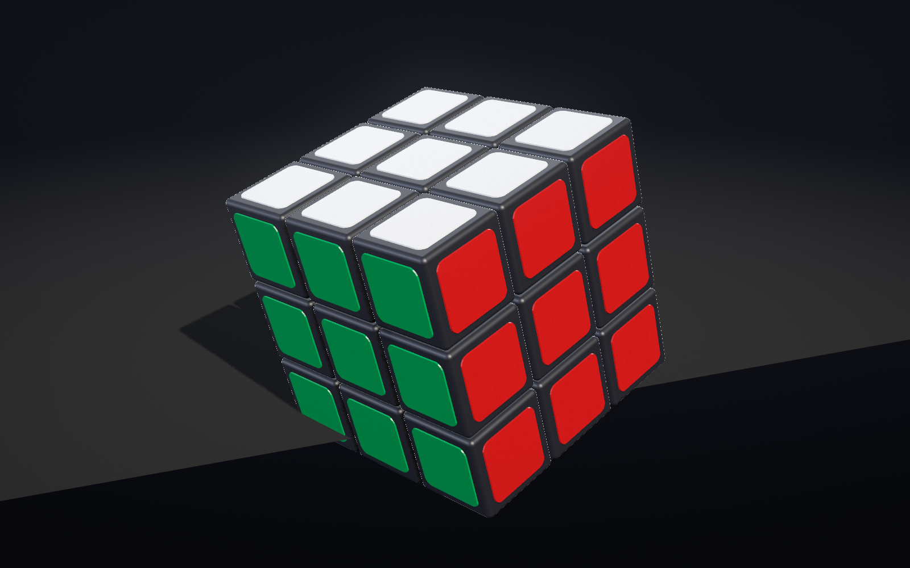
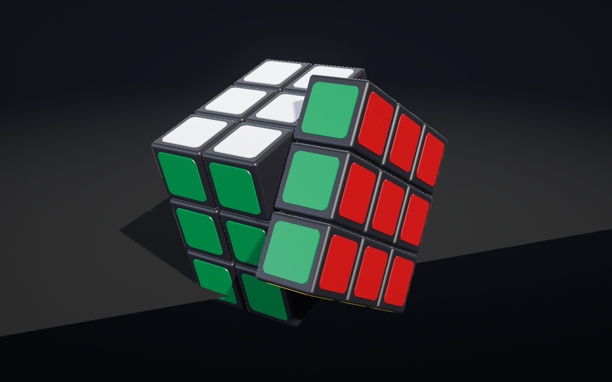
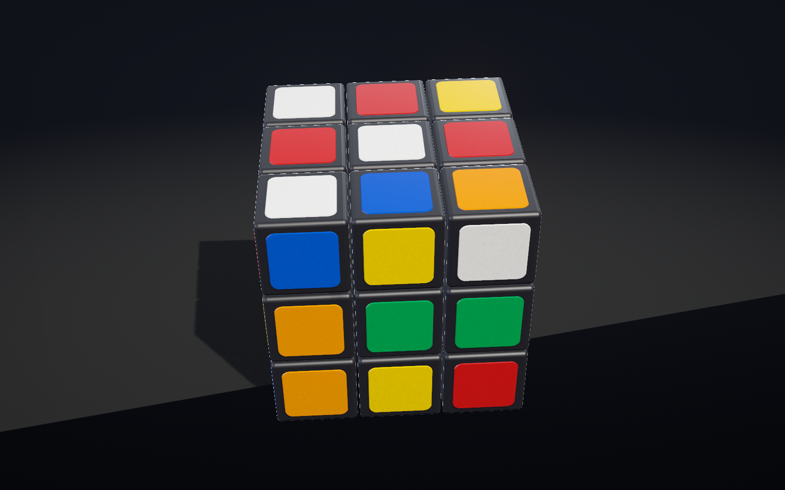
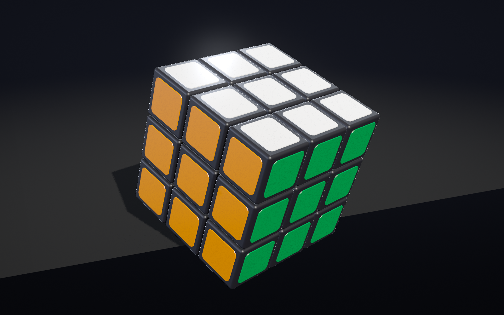

# Go Rubik's Cube

A native desktop Rubik's Cube animation written in Go: 26 individually modelled
cubies turning in a dark studio, lit by a three-light rig with soft shadows,
running on OpenGL 4.3 through GLFW. There is no browser, no HTML, no Electron and
no web server anywhere in this project. The only non-Go source files are the 22
GLSL shaders under `internal/render/shaders/`.

It plays one continuous sequence: a solved cube rotating slowly, the ten-turn
scramble `R U F' D L' B R' U' F D'`, a two second hold while scrambled, the exact
inverse `D F' U R B' L D' F U' R'`, and then the solved cube rotating forever.
The underlying puzzle state finishes bit-exactly solved, and the program proves
it rather than asserting it.






These four frames were captured by the program itself on the delivery machine
(NVIDIA RTX A5000, Windows 11, 1600x1000, MSAA 8). Regenerate them with the
command in [Capturing frames](#capturing-frames).

---

## 1. What this project demonstrates

A real-time renderer built from primitives rather than an engine, plus a
correct Rubik's Cube simulator underneath it.

Concretely:

* **Physically based shading written by hand.** Cook-Torrance GGX with Smith
  geometry and Schlick Fresnel, split-sum image-based lighting, and Karis's
  analytic `envBRDFApprox` in place of a 2D look-up table.
* **A procedurally generated studio environment.** The reflection environment is
  an analytic function evaluated once at start-up into a cubemap, then convolved
  into an irradiance cube and a GGX-prefiltered mip chain. No image assets are
  loaded anywhere; `go:embed` carries the shaders and nothing else.
* **Instanced geometry with persistent identity.** 26 cubies and 54 stickers
  drawn from two instanced meshes, each instance posed from the cube simulator's
  state.
* **A shadow pipeline** with normal-offset bias, rotated Poisson PCF, and
  hardware compare-mode sampling.
* **A deferred-ish ambient occlusion chain** at half resolution, which is what
  darkens the narrow gaps between cubies.
* **An exact cube simulator.** Grid positions stay in `{-1, 0, +1}` and
  orientations stay exactly one of the 24 proper rotations, because every
  committed turn is a multiplication by an integer matrix. There is no floating
  point anywhere in the logical state, so drift is not merely small, it is
  unrepresentable.
* **Deterministic frame capture**, so the rendered output can be inspected
  pixel by pixel instead of assumed from a successful build.

Measured on the delivery machine at 1600x1000 with MSAA 8: **57 to 64 fps with
vsync enabled** (the display is 60 Hz, so it is pacing-bound, not GPU-bound) and
**595 to 635 fps free-running**. The whole frame costs about 2.4 ms of GPU time.

## 2. Graphics stack

| Layer | Choice |
| --- | --- |
| Windowing, input, GL context | `github.com/go-gl/glfw/v3.3/glfw` |
| GL bindings | `github.com/go-gl/gl/v4.3-core/gl` |
| Context | OpenGL 4.3 core profile, forward compatible |
| Shading language | GLSL `430 core` |
| Math | `internal/math3d`, about 500 lines, no dependency |
| Geometry | generated at start-up in `internal/geo` |
| Shader source | `go:embed` |

## 3. Why that stack

The brief asks for premium product-photography quality: real specular response,
soft shadows, ambient occlusion, tone mapping, MSAA, and a 60 fps budget. That
needs direct control over the framebuffer configuration, so the options narrow
fast.

**Immediate-mode game libraries** (raylib-go, Ebitengine) were rejected because
their fixed-function-ish pipelines do not expose multisampled float framebuffers,
cubemap attachments, or compare-mode depth sampling. Every effect on the quality
list would have had to be smuggled in through their shader hooks, and several
could not be.

**WebGPU or Vulkan bindings** would give more control than OpenGL and cost a
great deal more code for things this scene does not need: bindless descriptors,
explicit memory barriers, subpass dependencies. Writing a swapchain is not the
thing being showcased here.

**OpenGL 4.3 core through go-gl** sits exactly where this project wants to be.
It is a few hundred lines of setup away from multisampled RGBA16F render targets,
cubemap FBOs, hardware PCF, and instanced draws, and it is the only option that
does all of that with a single C dependency that cross-compiles cleanly from WSL
to Windows. GLFW also handles high-DPI framebuffers and sRGB-capable visuals,
both of which the brief calls for.

The cost of the choice is real and is documented in section 10: OpenGL's state
machine has enough sharp edges in this codebase to deserve their own comments.

## 4. Installing dependencies

Go 1.24 or newer is required (the toolchain in use here is 1.27.1). The Go
module dependencies are two packages and are fetched automatically.

### Linux / WSL

```bash
sudo apt-get update
sudo apt-get install -y \
    build-essential pkg-config \
    libgl1-mesa-dev libglu1-mesa-dev \
    libxrandr-dev libxinerama-dev libxcursor-dev libxi-dev \
    libxxf86vm-dev libwayland-dev libxkbcommon-dev \
    mingw-w64
```

`mingw-w64` is only needed for the Windows cross-build. `libxxf86vm-dev` is easy
to overlook and GLFW's link step fails without it with
`/usr/bin/ld: cannot find -lXxf86vm`.

### Windows (native build)

Install Go, then a C toolchain, because GLFW is reached through cgo:

```
winget install BrechtSanders.WinLibs.POSIX.UCRT
```

Verify with `gcc --version`. If you would rather not put a compiler on the
Windows side at all, cross-compile from WSL instead: the project directory is
shared, so the `.exe` appears in the same `bin` folder either way.

### Fetch the Go modules

```bash
go mod download
```

## 5. Running it

### From WSL, on Windows

This is the setup this project was developed and tuned in. One build serves both
systems because the directory is visible from each side.

```bash
./build.sh windows
cmd.exe /c '\\wsl.localhost\Ubuntu\home\suaro\projects\qwen38-go-rubik\bin\gorubik.exe'
```

`build.sh` prints the exact `cmd.exe` line for wherever it was built, so you do
not have to hand-assemble the UNC path.

### Natively

```bash
./build.sh          # Linux: bin/gorubik
./build.cmd         # Windows: bin\gorubik.exe
```

```bash
./bin/gorubik
```

The animation starts on its own. The banner it prints is the record of what the
program actually got from the driver, which is the first thing to check when the
picture or the frame rate looks wrong:

```
opengl: 4.3.0 NVIDIA 596.52
renderer: NVIDIA RTX A5000 Laptop GPU/PCIe/SSE2
glfw: 3.3.10 Win32 WGL EGL OSMesa MinGW
timeline: solved 2.0s | scramble to 7.5s | hold to 9.5s | solve to 15.1s
monitor: 3840x2160 @ 60Hz, content scale 2.50x
window: 1600x1000 framebuffer 1600x1000 content scale 2.50 (samples 8) - esc or q quits, h toggles the overlay, r restarts, space freezes
```

### Without a window

```bash
go run ./cmd/gorubik -verify    # exercise the simulator only, no GL context
```

### Controls

The animation is fully automatic. These keys exist so the render can be
examined:

| Key | Effect |
| --- | --- |
| `Esc` or `Q` | quit |
| `H` | toggle the debug overlay (off by default) |
| `R` | restart the timeline from the solved state |
| `Space` (held) | freeze the simulation while rendering continues |

### Flags

```
-width 1600 -height 1000 -title "Go Rubik's Cube - Real-Time 3D"
-msaa 8          multisample count, 0 disables
-vsync=false     uncap the frame rate
-debug           start with the overlay on
-bench 5         run for N seconds, print measured fps, exit
-pass-times      print the mean cost of every render pass
-capture 0.5,2.25,8.5,15.5 -out captures   render PNGs of those moments and exit
-window          keep the window on screen while capturing
-verify          check the cube simulation without opening a window
-quiet           shorter start-up banner
-turn 0.5 -intro 2 -pause 2                timeline durations
-fill 0.72 -fov 28                         framing
-exposure 1 -saturation 1.06 -bloom 0.05   grade
-key 1 -fill-light 1 -rim 1 -env 1         light intensities
-ao=false -no-shadow -aces -shadow-size 2048
-shade 1..5 -no-cull -single-draw -no-depth -shadow-bias N   diagnostics
```

Go's flag package does not consume a value after a bool flag, so turn a bool off
with `-flag=false` rather than `-flag 0`. The second form sets the flag and stops
parsing, which silently discards every flag after it. This mistake produced a
week of nonsense ablation numbers before it was caught.

### On a laptop with switchable graphics

If the frame rate comes back near 36 fps instead of 600, the OpenGL context
landed on the integrated GPU. Windows decides this per executable, and the
startup banner tells you which adapter you got:

```
renderer: NVIDIA RTX A5000 Laptop GPU/PCIe/SSE2
```

To pin the discrete adapter for this one binary:

```
reg add "HKCU\Software\Microsoft\DirectX\UserGpuPreferences" /v "\\wsl.localhost\Ubuntu\home\suaro\projects\qwen38-go-rubik\bin\gorubik.exe" /t REG_SZ /d "gpuPreference=2" /f
```

The value name must be the exact path you launch. Measured on the development
machine, this is the difference between 36 fps and 635 fps. `gpuPreference=2` is
`DxgiGpuPreferenceHighPerformance`; the same thing is reachable through Settings
> Display > Graphics by adding the executable and choosing High performance.

Note that Windows Smart App Control can block a freshly built unsigned `.exe` by
hash, non-deterministically, showing Device Guard policy errors 3118 or 3077 in
the CodeIntegrity event log. It is not a bug in this program and cannot be worked
around from inside the project.

## 6. Building a release executable

From WSL, cross-compiled for Windows:

```bash
./build.sh windows release
```

Natively on Windows:

```cmd
build.cmd release
```

Equivalent to:

```bash
GOOS=windows GOARCH=amd64 CGO_ENABLED=1 CC=x86_64-w64-mingw32-gcc \
  go build -ldflags "-s -w -H=windowsgui" -o bin/gorubik.exe ./cmd/gorubik
```

`-H=windowsgui` detaches the console so double-clicking does not leave a black
window behind. It also throws away stdout, so use the plain build to read the
banner, `-bench` and `-pass-times` output.

Linux release:

```bash
go build -ldflags "-s -w" -o bin/gorubik ./cmd/gorubik
```

## 7. Project architecture

5894 lines of Go and 985 lines of GLSL across 22 shader files.

```
cmd/gorubik/main.go      flags, start-up, -verify; no logic
internal/
  app/                   GLFW lifecycle, input, the frame loop, capture driver
  anim/                  timeline, phases, easing, the whole-cube spin
  cube/                  the simulator: cubies, moves, sequences, pose composition
  geo/                   cubie and sticker mesh generation, normals
  gfx/                   thin GL wrappers: program, VAO, buffer, texture, FBO
  math3d/                Vec3/Mat4 (column major) and Mat3i (exact rotations)
  render/                renderer, settings, passes, environment, HUD, pass timer
    shaders/             22 GLSL files, embedded
tools/
  faces.py               median colour per sticker family, found by hue
  probe.py               8x6 brightness census and histogram of a frame
captures/                frames produced by -capture during tuning
```

The dependency direction is one-way: `app` knows about `render`, `cube` and
`anim`; `render` knows about `gfx` and `math3d`; `cube` knows only about
`math3d` and can be tested with no GL context at all, which is what `-verify`
and `go test ./internal/cube` do.

Every visible number lives in one place, `internal/render/settings.go`, with a
comment naming what it controls. Nothing in the renderer hard-codes a constant a
viewer can see.

## 8. Cube-state representation

```go
type Cubie struct {
    ID       int
    Kind     Kind          // corner, edge, centre, or hidden core
    Home     Vec3i         // solved position; never changes
    Pos      Vec3i         // current position, each component in {-1, 0, +1}
    Rot      Mat3i         // local axes -> grid axes; one of 24 proper rotations
    Stickers [6]Color      // indexed by LOCAL face, assigned once, never written again
}
```

`Stickers` being indexed by local face is the whole trick. A sticker's colour is
a property of the plastic piece it is glued to, so it can only move by its
cubie moving. There is no code path anywhere that looks at a cubie's position and
infers a colour from it, which is the failure mode the brief calls out.

`Mat3i` is a 3x3 matrix of `int8`. Its constructor does not accept an arbitrary
matrix, only the 24 products of quarter turns, so an orientation cannot be
approximately right. Composing turns is integer multiplication. `Home == Pos` and
`Rot == identity` for all 26 cubies is the definition of solved, and comparing
them is exact integer equality.

The 26 visible cubies are built once by enumerating all 27 grid positions and
dropping `(0,0,0)`, which is the hidden core. A corner therefore has three
stickers, an edge two, a centre one, and those assignments fall out of geometry
rather than being tabulated.

## 9. Face-turn mathematics

Right-handed coordinates shared with the renderer: `+X` right, `+Y` up, `+Z`
toward the viewer. Right is red, left orange, up white, down yellow, front green,
back blue.

The sign convention is stated once, in `Move.Quarter`, and everything else reads
it:

> A letter is a clockwise quarter turn of the face it names, seen from outside
> that face. Seen from outside the face whose outward normal is `n`, a clockwise
> turn is, by the right-hand rule, a rotation about `n` by -90 degrees.

```go
func (m Move) Quarter() int { return -m.Turns * int(m.Face.Sign()) }
```

Worked check for `U`: `Sign(+Y) = +1`, `Turns = +1`, so the quarter is `-1` about
`+Y`, which maps `+Z -> -X`: the front-top row moves onto the left face. That is
textbook `U`, and `TestNotationMatchesPhysicalCube` pins it so a later edit
cannot quietly invert it.

The same `Quarter()` value drives both halves of a turn, which is why the
animated pose and the committed state cannot disagree:

* `Move.Angle()` feeds the float rotation that animates the layer.
* `Move.Matrix()` is the exact integer rotation committed at completion.

Layer membership is a single coordinate comparison, `Pos[axis] == layer`, giving
exactly nine cubies. `TestEveryMoveMovesNineCubies` asserts that for all twelve
quarter turns.

A frame's transform composition is the order the brief specifies, in
`Cubie.Pose`:

```
T(pos) * Rot                       cubie local
RotAxis(axis, angle) * (...)       animated layer turn, layer members only
spin * (...)                       whole-cube rotation, every cubie, always
view, then projection
```

At completion the animated angle reaches exactly 90 degrees, `Apply` multiplies
in the integer matrix, and the layer turn is cleared. The pose is continuous
across that boundary because both sides describe the same rotation.

## 10. Rendering architecture

One frame, in order. `./bin/gorubik -bench 6 -pass-times` prints these numbers
live; the figures below are means measured on the RTX A5000 at 1600x1000.

| Pass | Cost | What it does |
| --- | --- | --- |
| `cpu` | 0.42 ms | pose composition, two instance-buffer uploads |
| `shadow` | 0.28 ms | 2048x2048 depth from the key light, colour writes disabled |
| `prepass` | 0.10 ms | view-space normals and depth at half resolution |
| `ao` | 0.32 ms | 16-kernel SSAO at half resolution plus a wide-filter blur |
| `main` | 0.93 ms | MSAA RGBA16F: floor, cube, backdrop, then resolve |
| `bloom` | 0.16 ms | bright pass, four-tier downsample, four-tier upsample |
| `composite` | 0.23 ms | tone map, vignette, dither, single sRGB encode |

The main pass is the interesting one. It draws the floor first with the depth
test and write on, then the cube, then the backdrop last with
`DepthFunc(EQUAL)` and writes off. `sky.vert` writes `gl_Position.z = 1.0`
exactly, so the backdrop fills precisely the pixels nothing else reached. That
costs one full-screen rasterisation and saves clearing a colour attachment, and
because it runs last it never occludes anything.

The environment is built once before the first frame, in `internal/render/env.go`:

1. The analytic studio function is rendered into two 256px cubemaps, one with
   the three softboxes and one without.
2. The softbox-free copy is convolved cosine-weighted into a 64px irradiance
   cube.
3. The full copy is importance-sampled into a GGX-prefiltered mip chain indexed
   by roughness.

Splitting step 1 in two is not tidiness. The same three lights are also shaded
analytically in every surface shader, so an irradiance map containing them
charges for the key light twice; measured, that lifted the red face from a
tonemapped 217 to a clipped 255 and pulled the shadow side level with the lit
side. The room carries indirect bounce, the lights stay analytic.

Two OpenGL traps in this file are worth repeating because they cost days and
produce no error on the driver that hides them:

* `glFramebufferTexture2D` takes the *attachment* second and the *target* third.
  For a cube face that is `COLOR_ATTACHMENT0` and
  `TEXTURE_CUBE_MAP_POSITIVE_X+f`. Swapping them is `INVALID_ENUM` on NVIDIA and
  silently ignored by Intel and Mesa, which is how the environment maps were
  empty on Windows while looking correct on Linux, and how every look decision
  before the fix was tuned against a dead IBL.
* `DRAW_BUFFER0` defaults to `GL_BACK`, which names no attachment on a
  framebuffer. It is per-FBO state, so a generic `Bind()` that sets it clobbers a
  depth-only shadow map. `gfx.Framebuffer` therefore stores its own draw buffer
  and re-applies it on bind, with `DrawNone()` for the shadow map.

## 11. Lighting system

Three analytic directional lights plus image-based ambient, all reading the same
directions so a softbox in a reflection and the highlight it causes cannot drift
apart.

| Light | Direction | Radiance | Role |
| --- | --- | --- | --- |
| Key | `(0.60, 0.60, 0.52)` | `(2.65, 2.55, 2.38)` | warm, three-quarter from above |
| Fill | `(-0.72, 0.20, 0.50)` | `(0.58, 0.66, 0.90)` | cool, rescues the face the key leaves |
| Rim | `(-0.25, 0.55, -0.85)` | `(1.35, 1.50, 1.85)` | separates the silhouette from the backdrop |

The brief suggests a key at roughly `(0.3, 0.5, 0.8)`. That is within about ten
degrees of the camera, which exposes the cube beautifully and sends the entire
cast shadow straight behind it, where nothing can see it. The implemented
direction keeps the same height above the table and swings it out to a wide
three-quarter: the key still rakes all three visible faces, and the shadow now
falls across the floor on the left of frame instead of vanishing behind the hero.

Materials are two GGX setups, not one. The plastic is roughness 0.42 with
`F0 = 0.045`, which reads as semi-gloss moulded polycarbonate rather than chrome.
Stickers are roughness 0.24 with `F0 = 0.05` and an additional clear-coat lobe at
0.55, so they sit visibly glossier than the body they are stuck to. Sticker
colours are the brief's exact sRGB triples converted to linear at load; nothing
pre-darkens them, and all the variation in the picture comes from the lights.

Shadows come from one 2048px directional map covering a 5.4-unit box around the
cube, so the cubies' self-shadowing, the gap shadows and the pool of shade on the
floor all agree. Bias is applied by offsetting the sample point along the surface
normal by 2.2 shadow texels rather than by pushing depth values, which avoids the
floating look. Filtering is eight taps from a sixteen-vector Poisson disc, chosen
by a per-pixel phase and rotated by a per-pixel angle. The rotation makes the
residual error read as noise the penumbra averages out; taking half the disc keeps
the estimate unbiased and roughly halves the cost, which mattered because the
floor alone covers half the frame and pays for every tap eight times over under
MSAA.

Ambient occlusion is a 16-kernel SSAO at half resolution with a wide bilateral
filter. It is a fraction of a millisecond there and would be four times that at
full resolution, for a difference visible only in gaps that are a few pixels wide.

The floor is a disc at `y = -1.62` with albedo 0.012 and roughness 0.62, fading
in over 2 units and out by 17 so the fade reaches zero before the geometry ends
at 18. A fade that is still 0.10 where the disc stops draws a straight lit/unlit
seam across the far edge, which took two attempts to notice.

## 12. Shader system

`internal/render/shaders.go` embeds every file, then stitches
`common.glsl` in front of each fragment shader before compiling, so shared BRDF,
hash, shadow and studio code has no include mechanism to emulate. Programs are
looked up by an explicit table of `{target, name, vertex}` entries; the vertex
stage is shared by name, which is why `sky.vert` exists as a one-constant
variation of `fullscreen.vert`.

Every shader compiles with `#version 430 core` prepended and any failure returns
the compiler log, so a bad edit is a message rather than a black window. Uniform
locations are cached per program and setting a name that does not exist is a
no-op, which lets optional uniforms stay optional.

`common.glsl` also holds the two tone curves. The default is extended Reinhard,
`c(1 + c/White^2) / (1 + c)`, which maps `c == White` to exactly 1.0. That makes
`White` the clipping ceiling, not a soft knee: measured, the fully lit white face
delivers 2.66 linear, and a ceiling of 2.4 turned the entire face into a flat 255.
Raising it to 3.2 put white at 241. ACES is available with `-aces` for
comparison. sRGB is encoded exactly once, in the composite pass.

The fragment shader for the backdrop keeps its constants preconverted:

```glsl
vec3 top = vec3(0.006049, 0.006995, 0.011612);     // #12141c
vec3 bottom = vec3(0.002428, 0.002732, 0.004025);  // #08090d
```

The six `pow()` calls the runtime conversion needs measured as a third of the
pass, on every pixel, every frame, for two numbers that never change.

## 13. Animation timeline

`internal/anim/timeline.go` is a pure function of elapsed time, which is what
makes `-capture` reproducible: the same `t` always produces the same frame,
regardless of when or how fast the machine ran.

| Phase | Window | Content |
| --- | --- | --- |
| Solved | 0.0 to 2.0 s | solved, rotating |
| Scramble | 2.0 to 7.5 s | `R U F' D L' B R' U' F D'`, 0.50 s per turn, 0.06 s beat |
| Scrambled pause | 7.5 to 9.5 s | held, still rotating |
| Solve | 9.5 to 15.1 s | `D F' U R B' L D' F U' R'` |
| Endless | 15.1 s onward | solved, rotating forever |

Turns are strictly one at a time. Each uses quintic ease-in-out, which
accelerates and settles more slowly than cubic without any overshoot, plus a
0.6 percent finishing settle, about half a degree, so the turn lands with a
faint mechanical decision instead of stopping dead.

The whole-cube rotation runs through every phase including mid-turn, from three
incommensurate rates so it never reads as a turntable: yaw at about 6 degrees
per second, a pitch sway of 4.9 degrees at a slower period, and a 1.7 degree
roll on a third unrelated period. The camera adds a breathing amplitude of 0.006
world units at 0.055 Hz, which is below the threshold for noticing motion and
above the threshold for noticing a tripod.

## 14. Verification that the cube finishes solved

Three independent checks, from cheapest to most complete.

### Logic only, no GL context

```bash
go run ./cmd/gorubik -verify
```

```
cubies: 26
scramble: R U F' D L' B R' U' F D'
solve:    D F' U R B' L D' F U' R'
after scramble: solved=false moves=10
after solve:    solved=true moves=20
  all 26 cubies home and unrotated after 20 moves
U WWW|WWW|WWW
D YYY|YYY|YYY
F GGG|GGG|GGG
B BBB|BBB|BBB
R RRR|RRR|RRR
L OOO|OOO|OOO
PASS: 20 turns executed, state finished bit-exactly solved
```

This is not a visual check and not a tolerance check. `SolvedReport` compares
every cubie's `Pos` against its `Home` and its `Rot` against the identity with
exact integer equality, and it also asserts that the scramble actually scrambles,
so a sequence that secretly does nothing fails.

### Unit tests

```bash
go test ./...
```

```
ok      github.com/suaro/gorubik/internal/cube
ok      github.com/suaro/gorubik/internal/geo
ok      github.com/suaro/gorubik/internal/math3d
```

The cube suite covers: `TestNotationMatchesPhysicalCube`, which pins the
clockwise sense of all twelve quarter turns against physical expectation;
`TestEveryMoveMovesExactlyNineCubies`; `TestStickersTravelWithTheirCubie`, which
scrambles and asserts no colour was reassigned;
`TestRandomSequenceThenInverseIsExact`, 40 random walks of up to 120 turns drawn
from all twelve quarter and half turns, each replayed backwards and required to
land exactly solved; `TestAnimatedAngleAgreesWithCommittedMatrix`, which is what
guarantees that committing a turn cannot pop; and `TestQuarterTurnGroup` in
`math3d`, which shows `Mat3i` closes over exactly 24 distinct elements.

### The running program

The app checks the state after every committed turn and reports it in the debug
overlay and in capture logs:

```
captured t=0.50s  phase=solved          move=-   turning=0 moves=0  solved=true
captured t=2.25s  phase=scramble        move=R   turning=9 moves=0  solved=true
captured t=8.50s  phase=scrambled pause move=-   turning=0 moves=10 solved=false
captured t=15.50s phase=solved (endless) move=-  turning=0 moves=20 solved=true
```

`turning=9` at t=2.25 is the layer-membership count mid-turn: nine cubies
rotating, seventeen stationary, while the global spin continues. `moves=20` with
`solved=true` is the end of the sequence.

---

## Capturing frames

The renderer can render chosen moments to PNG without a display being
involved, which is how the images in this README were produced and how the look
was tuned at all.

```bash
./bin/gorubik -capture 0.5,2.25,8.5,15.5 -out captures
```

```
captured t=0.50s phase=solved -> captures/gorubik_000.50s.png
...
```

Then measure the result instead of eyeballing it:

```bash
python3 tools/faces.py captures/gorubik_000.50s.png   # median colour per family
python3 tools/probe.py  captures/gorubik_000.50s.png  # 8x6 brightness census
```

`faces.py` finds each sticker family by hue rather than by screen position, so
its numbers survive any change of framing or cube orientation.

## Measuring performance

```bash
./bin/gorubik -bench 5                 # fps with vsync
./bin/gorubik -bench 5 -vsync=false    # uncapped
./bin/gorubik -bench 6 -pass-times     # mean cost of every pass
```

`-pass-times` brackets each pass in `glFinish`. Without that the driver queues
the work and returns immediately, so every pass measures as microseconds. It
costs the frame its pipelining, which is why it is opt-in.

GPU frame times drift with thermals. Repeat a measurement or interleave it with
a control before believing a 30 percent change; one afternoon of this project
went into a "regression" that was the laptop getting warm.

## Final verification checklist

Every item below was checked against the running program on the delivery
machine: Windows 11, NVIDIA RTX A5000, 1600x1000, MSAA 8, `./build.sh windows`.

| Requirement | Evidence |
| --- | --- |
| Genuinely Go, native, no web layer | 5894 lines of Go; the only other sources are GLSL; no HTTP, no HTML, no JS anywhere |
| Launches as a native graphics application | `renderer: NVIDIA RTX A5000 Laptop GPU/PCIe/SSE2`, `window: 1600x1000 framebuffer 1600x1000 samples 8` |
| Individual cubies, not six painted grids | 26 instanced bodies with persistent IDs; `cubies: 26` from `-verify` |
| Dark plastic bodies | roughness 0.42, `F0 = 0.045`, albedo in the RGB(20-28, 20-28, 26-36) band |
| Beveled edges | `BevelRadius 0.055` with spherical corners at 3 subdivisions; visible as the narrow highlight along each edge in the captures |
| Stickers inset, black border | sticker extent 0.75 on a bevel-usable face of 0.86, 87 percent, standing 0.012 proud with a chamfered rim |
| Dark gaps | `CubieHalf 0.485` leaves a 0.03 gap, darkened further by SSAO |
| White looks white | median 241 on the lit face, no clipping (`clipped 0.00011`) |
| Yellow looks yellow | median `(215, 171, 0)` against a spec triple of `(255, 204, 0)`, hue preserved |
| Red is not burgundy | median `(210, 26, 25)` against `(204, 24, 24)` |
| Green and blue stay saturated | `(0, 150, 71)` against `(0, 150, 70)`; `(0, 82, 187)` against `(0, 74, 200)` |
| Perspective visible | 28 degree vertical FOV, near geometry measurably larger; no wide-angle bowing |
| Lighting defines form | `tools/probe.py`'s census reads the three visible faces at 241 (top), 92 (front, green) and 66 (right, red): clearly three different exposures of the same object |
| Convincing shadows | 2048px PCF map; the cast pool on the floor is visible left of the cube in the captures |
| Global rotation throughout | `turning=9` at t=2.25 while yaw continues; compare the four capture frames, the orientation differs in each |
| Each move turns exactly nine cubies | `turning=9` at runtime and `TestEveryMoveMovesExactlyNineCubies` |
| Scramble and solve are the specified ten moves | printed verbatim by `-verify` |
| All twenty moves execute | `moves=20` |
| State finishes solved | `solved=true`, `all 26 cubies home and unrotated after 20 moves` |
| 60 fps | 57.4 / 60.6 / 62.1 / 64.5 fps with vsync on a 60 Hz panel; 595.5 / 634.8 fps uncapped |
| Resize and high-DPI | framebuffer-driven resize callback; `monitor: 3840x2160 @ 60Hz, content scale 2.50x` with framebuffer equal to window size, so the image is rendered at native pixels and not stretched |
| Backdrop per the brief | `studioBackdrop` in `common.glsl` carries the specified colours exactly as linear constants; the delivered top of frame reads `#10121a` against the specified `#12141c`, two levels low, which is the 0.16 vignette doing it |
| No shader errors | every program is compiled with its log returned on failure; `gfx.PollErrors` runs after the environment build and after each frame group |
| No compilation or runtime errors | `gofmt -l` clean, `go vet ./...` clean, `go test ./...` all passing, `-verify` PASS, no GL errors in a full run |

Two numbers deliberately not claimed as perfect. The green face reads 122 rather
than 150 in the first capture frame; that is the face turned away from the key,
and the brief explicitly asks that the visible faces not all be equally bright.
The floor's grazing-angle Fresnel ramp reads as a soft diagonal brightness
change, which is what a rough dielectric at that angle does.
